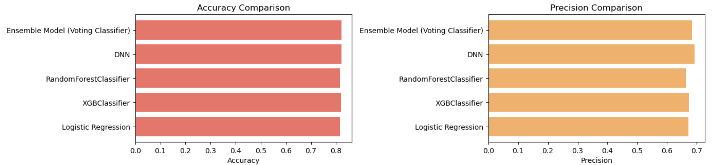
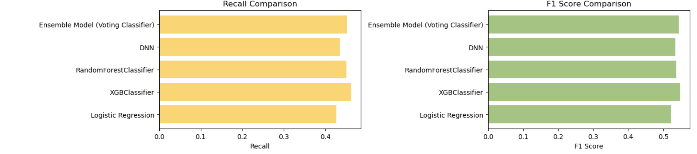
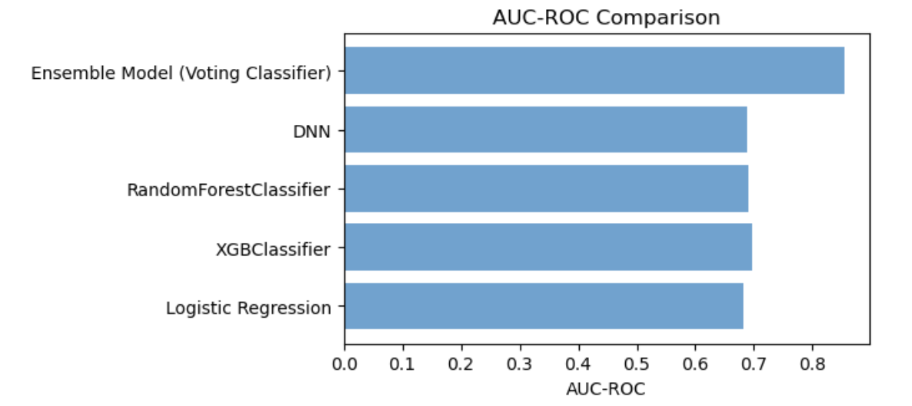

## Anticipating Hospital Admissions from the Emergency Department

### Problem Identification

Most visits to the emergency department (ED) conclude with the patient being discharged, yet these departments stand out as the primary gateway for hospital admissions. When patients arrive at the ED, they undergo a critical sorting process known as "triage," which determines the urgency of their medical needs. This essential task is usually carried out by a skilled member of the nursing staff who assesses various factors, including the patient's demographic information, their principal complaint, and vital signs. After this initial evaluation, the patient is seen by a medical provider who formulates an initial care plan tailored to their specific situation. Based on this assessment, the provider ultimately makes a recommendation regarding the patient’s next steps, which in this study focuses on whether the patient should be admitted to the hospital or discharged to continue their recovery elsewhere.

This process is important because accurate triage and subsequent decisions significantly impact patient outcomes and hospital resource management. Proper triage ensures that patients with the most urgent needs receive timely care, which can be crucial for their recovery and survival. Additionally, effective triage and decision-making help optimize the use of hospital resources, reducing overcrowding in the emergency department and ensuring that hospital beds are available for those who truly need them.

If we cannot accurately predict the need for hospital admission versus discharge, several negative consequences can arise:

1. **Patient Safety Risks**: Patients who require urgent care might not receive timely treatment, leading to worsened health outcomes or even fatalities.

2. **Overcrowding**: Misjudging the severity of conditions can lead to overcrowded emergency departments, causing delays in treatment for all patients and increasing the risk of medical errors.

3. **Resource Misallocation**: Inefficient use of hospital resources, such as admitting patients who could safely be discharged or discharging patients who need inpatient care, can strain the healthcare system and increase costs.

4. **Increased Healthcare Costs**: Unnecessary admissions can lead to higher healthcare costs for both hospitals and patients, while inadequate care can result in complications requiring more extensive treatment later.

5. **Patient Dissatisfaction**: Delays and inefficiencies in care can lead to patient dissatisfaction, potentially reducing trust in the healthcare system.

Predictive models and accurate assessments are thus critical for maintaining the efficiency and effectiveness of emergency care, ensuring that patients receive appropriate treatment and resources are used optimally.

The main goal for this project is to predict hospital admissions at the time of ED triage by using patient demographics and information gathered during triage.

#### Dataset Description

The dataset includes all adult emergency department visits from March 2014 to July 2017 at one academic and two community emergency rooms that resulted in either admission or discharge. A total of 972 variables were collected for each patient visit. In this study, we only consider the demographic information and information gathered during the triage:

**Demographics:**
- ``age``
- ``gender``
- ``ethnicity``
- ``race``
- ``language``
- ``religion``
- ``marital status``
- ``employment status``
- ``insurance status``

**Triage and Hospital Usage:**
- ``dep_name``: presenting hospital (recoded into A, B, C)
- ``esi``: ESI level determined by triage nurse
- ``disposition``: admission or discharge
- ``arrivalmode``: ambulance, walk-in, car, etc.
- ``arrivalmonth``: month of arrival (Jan-Dec)
- ``arrivalday``: day of arrival (Mon-Sun)
- ``arrivalhour_bin``: hour of arrival, binned to 4-hour timeframes (23-02, 03-06, etc.)
- ``triage_vital_hr``: heart rate recorded at triage
- ``triage_vital_sbp``: systolic blood pressure recorded at triage
- ``triage_vital_dbp``: diastolic blood pressure recorded at triage
- ``triage_vital_rr``: respiratory rate recorded at triage
- ``triage_vital_o2``: O2 saturation recorded at triage
- ``triage_vital_o2_device``: presence of supplementary O2 device at triage
- ``triage_vital_temp``: temperature recorded at triage
- ``n_edvisits``: number of ED visits within the past year
- ``n_admissions``: number of in-patient admissions within the past year
- ``previousdispo``: disposition of the patient's last visit to the ED
- ``n_surgeries``: number of surgeries and procedures within the past year

The dataset is available at: [Admission Prediction Dataset](https://github.com/yaleemmlc/admissionprediction/tree/master/Results)

## **Data Cleaning and Explotary Data Analysis (EDA)**

[Data wrangling and EDA notebook](notebooks/prediction_disposition.ipynb)

There is a considerable amount of triage data missing in this dataset, which poses a challenge for accurate analysis and prediction. To address this issue, we employed the K-Nearest Neighbors Imputer (KNNImputer) technique to substitute the missing values. This method involves replacing the missing values with the mean values of the 10 nearest neighbors. By leveraging the KNNImputer, we ensure that the imputed values are based on actual patient data, thus maintaining the integrity and variability of the dataset. This approach not only helps in preserving the overall data distribution but also enhances the robustness of our subsequent analyses and predictive models. The use of the KNNImputer allows us to mitigate the impact of missing data, providing a more complete and reliable dataset for our study.

### **Explotary Data Analysis (EDA)**

In addition to data imputation, we employed heat maps and several chi-square hypothesis tests to examine the relationships between various variables and identify which ones have the most significant impact. Heat maps enabled us to visually assess the correlations between different variables, providing an intuitive way to spot patterns and potential areas of interest.

We also identify the outliers, and study and anlysis if they have a considerable impact on the addmition. 

To quantitatively verify these relationships, we performed chi-square hypothesis testing. This statistical test helps determine whether there is a significant association between categorical variables. By applying the chi-square test, we could identify which variables are statistically significant and contribute most to the outcomes of interest, such as patient admission or discharge decisions.

These combined methods—imputation using KNNImputer, visual inspection with heat maps, and statistical validation through chi-square tests—provided a comprehensive approach to handling missing data and understanding the key factors influencing patient outcomes. This rigorous analytical process ensures that our findings are both reliable and actionable.

## **Pre-processing and Training Data Development**
[Pre-Processing and Modelling](notebooks/Pre-processingTrainingDataDevelopment.ipynb)

We provide a comparison of performance metrics for different classification models used on the same dataset. The models compared include Logistic Regression, XGBClassifier, RandomForestClassifier, Deep Neural Network (DNN), and an Ensemble Model (Voting Classifier) of all the previous models. The metrics compared are Accuracy, Precision, Recall, F1 Score, and AUC-ROC.

#### Key Observations:

1. **Accuracy**:
   - The Ensemble Model (Voting Classifier) has the highest accuracy at 0.8213.
   - The Deep Neural Network (DNN) closely follows with an accuracy of 0.8208.
   - Logistic Regression has the lowest accuracy at 0.8153.

2. **Precision**:
   - The DNN achieves the highest precision at 0.6923, indicating it is the best at correctly identifying positive instances among those predicted as positive.
   - The RandomForestClassifier has the lowest precision at 0.6627.
  
     
   
3. **Recall**:
   - The XGBClassifier has the highest recall at 0.4621, meaning it is the best at identifying all actual positive instances.
   - Logistic Regression has the lowest recall at 0.4269, indicating it misses more actual positive instances compared to other models.

4. **F1 Score**:
   - The XGBClassifier has the highest F1 Score at 0.5481, suggesting it has the best balance between precision and recall.
   - Logistic Regression has the lowest F1 Score at 0.5221.

5. **AUC-ROC**:
   - The Ensemble Model (Voting Classifier) has the highest AUC-ROC at 0.8543, indicating the best overall ability to distinguish between positive and negative classes.
   - Logistic Regression has the lowest AUC-ROC at 0.6812, indicating the poorest performance in distinguishing between classes.

### Conclusions:

- **Ensemble Model (Voting Classifier)**:
  - This model stands out with the highest AUC-ROC score (0.8543) and high accuracy (0.8213), making it the best overall performer in terms of distinguishing between classes and general prediction accuracy.

- **Deep Neural Network (DNN)**:
  - The DNN shows strong performance with the highest precision (0.6923) and near-top accuracy (0.8208), indicating it is very effective at correctly predicting positive instances among those it classifies as positive.

- **XGBClassifier**:
  - This model excels in recall (0.4621) and F1 Score (0.5481), making it particularly effective in identifying positive instances and balancing precision and recall.

- **Logistic Regression**:
  - While Logistic Regression has the lowest performance across most metrics, it still serves as a useful baseline model with reasonable accuracy (0.8153) and AUC-ROC (0.6812).

- **RandomForestClassifier**:
  - This model performs moderately well across all metrics but does not lead in any particular area. Its performance is solid but not exceptional compared to the other models.

Overall, the Ensemble Model (Voting Classifier) provides the best overall performance, making it the preferred choice if one aims to maximize both accuracy and the ability to distinguish between classes. The DNN and XGBClassifier also show strong individual performance in precision and recall, respectively, and could be considered depending on the specific needs of precision or recall in a given application.

