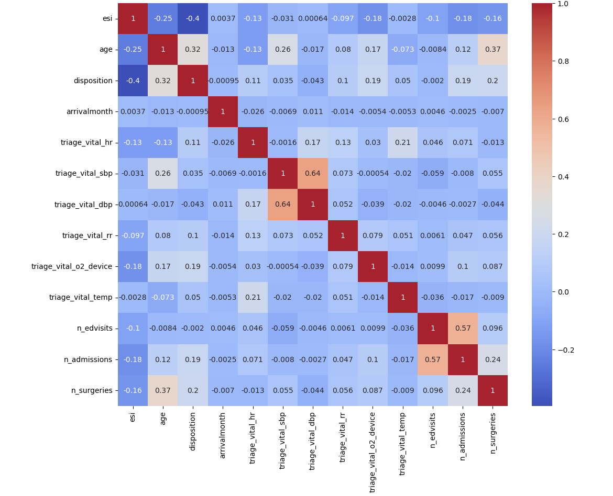
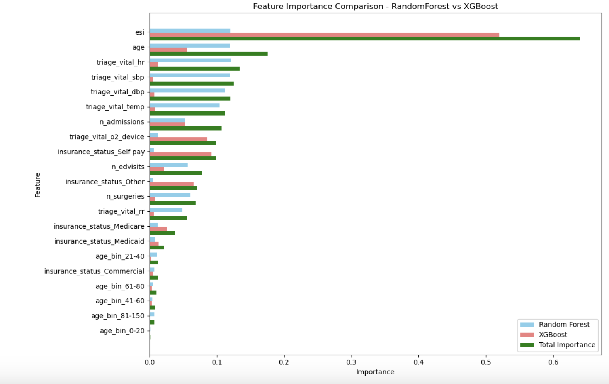
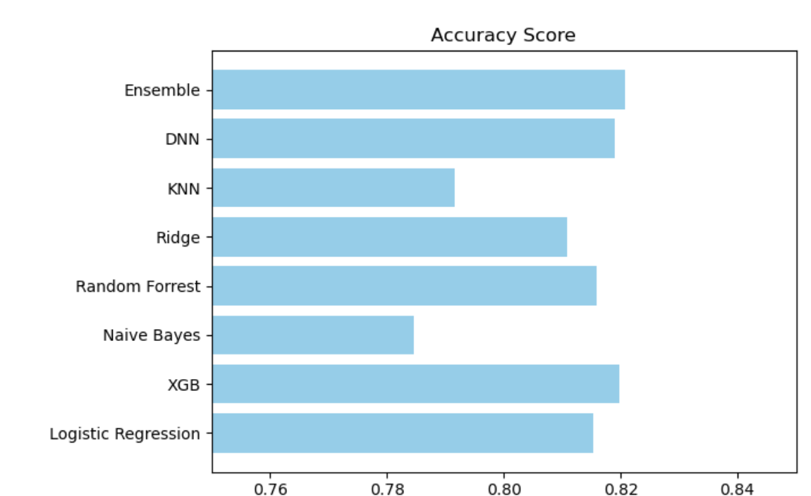
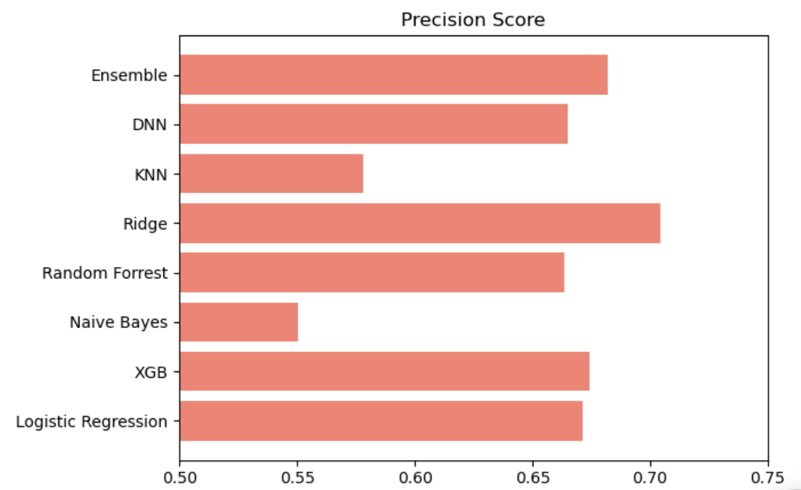
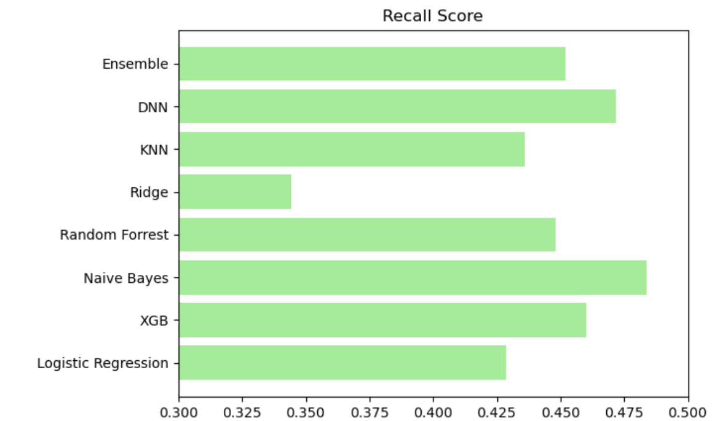
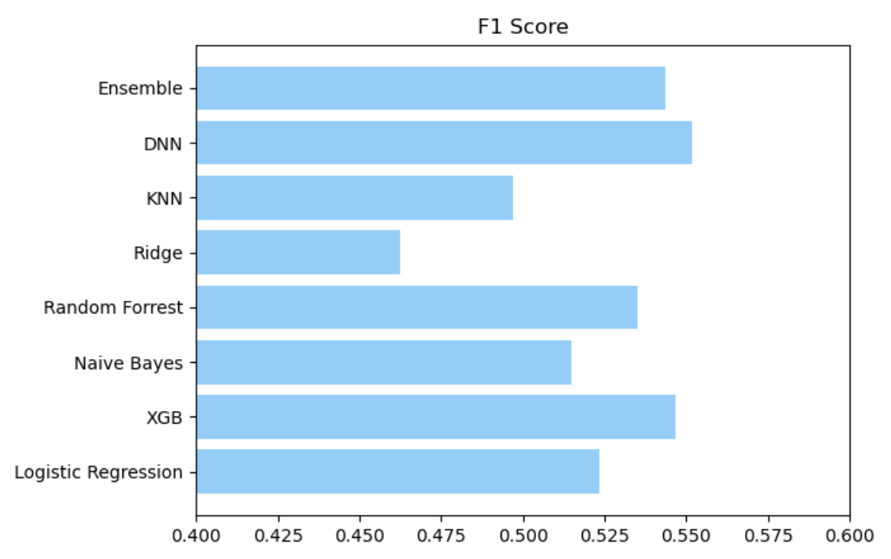
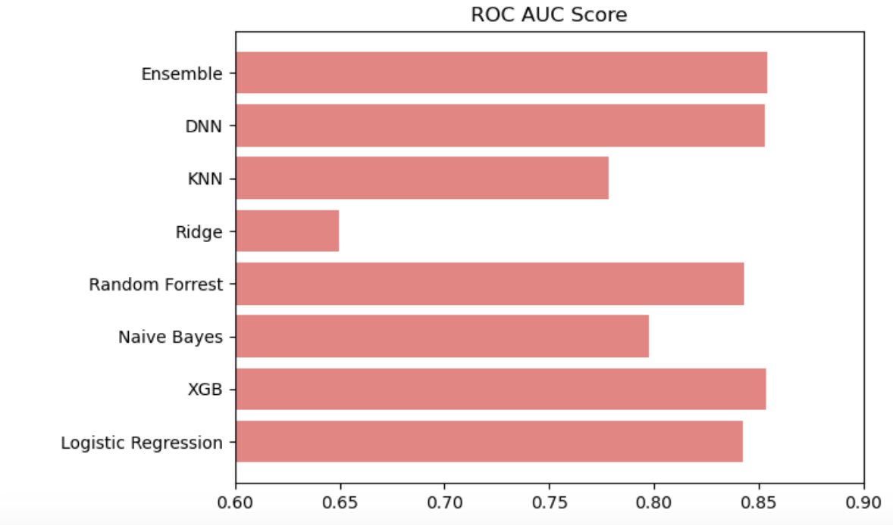

## Anticipating Hospital Admissions from the Emergency Department

### Problem Identification

Most visits to the emergency department (ED) conclude with the patient being discharged, yet these departments stand out as the primary gateway for hospital admissions. When patients arrive at the ED, they undergo a critical sorting process known as "triage," which determines the urgency of their medical needs. This essential task is usually carried out by a skilled member of the nursing staff who assesses various factors, including the patient's demographic information, their principal complaint, and vital signs. After this initial evaluation, the patient is seen by a medical provider who formulates an initial care plan tailored to their specific situation. Based on this assessment, the provider ultimately makes a recommendation regarding the patient’s next steps, which in this study focuses on whether the patient should be admitted to the hospital or discharged to continue their recovery elsewhere.

This process is important because accurate triage and subsequent decisions significantly impact patient outcomes and hospital resource management. Proper triage ensures that patients with the most urgent needs receive timely care, which can be crucial for their recovery and survival. Additionally, effective triage and decision-making help optimize the use of hospital resources, reducing overcrowding in the emergency department and ensuring that hospital beds are available for those who truly need them.

If we cannot accurately predict the need for hospital admission versus discharge, several negative consequences can arise:

1. **Patient Safety Risks**: Patients who require urgent care might not receive timely treatment, leading to worsened health outcomes or even fatalities.

2. **Overcrowding**: Misjudging the severity of conditions can lead to overcrowded emergency departments, causing delays in treatment for all patients and increasing the risk of medical errors.

3. **Resource Misallocation**: Inefficient use of hospital resources, such as admitting patients who could safely be discharged or discharging patients who need inpatient care, can strain the healthcare system and increase costs.

4. **Increased Healthcare Costs**: Unnecessary admissions can lead to higher healthcare costs for both hospitals and patients, while inadequate care can result in complications requiring more extensive treatment later.

5. **Patient Dissatisfaction**: Delays and inefficiencies in care can lead to patient dissatisfaction, potentially reducing trust in the healthcare system.

Predictive models and accurate assessments are thus critical for maintaining the efficiency and effectiveness of emergency care, ensuring that patients receive appropriate treatment and resources are used optimally.

The main goal for this project is to predict hospital admissions at the time of ED triage by using patient demographics and information gathered during triage.

#### Dataset Description

The dataset includes all adult emergency department visits from March 2014 to July 2017 at one academic and two community emergency rooms that resulted in either admission or discharge. A total of 972 variables were collected for each patient visit. In this study, we only consider the demographic information and information gathered during the triage:

**Demographics:**
- ``age``
- ``gender``
- ``ethnicity``
- ``race``
- ``language``
- ``religion``
- ``marital status``
- ``employment status``
- ``insurance status``

**Triage and Hospital Usage:**
- ``dep_name``: presenting hospital (recoded into A, B, C)
- ``esi``: ESI level determined by triage nurse
- ``disposition``: admission or discharge
- ``arrivalmode``: ambulance, walk-in, car, etc.
- ``arrivalmonth``: month of arrival (Jan-Dec)
- ``arrivalday``: day of arrival (Mon-Sun)
- ``arrivalhour_bin``: hour of arrival, binned to 4-hour timeframes (23-02, 03-06, etc.)
- ``triage_vital_hr``: heart rate recorded at triage
- ``triage_vital_sbp``: systolic blood pressure recorded at triage
- ``triage_vital_dbp``: diastolic blood pressure recorded at triage
- ``triage_vital_rr``: respiratory rate recorded at triage
- ``triage_vital_o2``: O2 saturation recorded at triage
- ``triage_vital_o2_device``: presence of supplementary O2 device at triage
- ``triage_vital_temp``: temperature recorded at triage
- ``n_edvisits``: number of ED visits within the past year
- ``n_admissions``: number of in-patient admissions within the past year
- ``previousdispo``: disposition of the patient's last visit to the ED
- ``n_surgeries``: number of surgeries and procedures within the past year

The dataset is available at: [Admission Prediction Dataset](https://github.com/yaleemmlc/admissionprediction/tree/master/Results)

## **Data Cleaning and Explotary Data Analysis (EDA)**

[Data wrangling and EDA notebook](notebooks/prediction_disposition.ipynb)

There is a considerable amount of triage data missing in this dataset, which poses a challenge for accurate analysis and prediction. To address this issue, we employed the K-Nearest Neighbors Imputer (KNNImputer) technique to substitute the missing values. This method involves replacing the missing values with the mean values of the 10 nearest neighbors. By leveraging the KNNImputer, we ensure that the imputed values are based on actual patient data, thus maintaining the integrity and variability of the dataset. This approach not only helps in preserving the overall data distribution but also enhances the robustness of our subsequent analyses and predictive models. The use of the KNNImputer allows us to mitigate the impact of missing data, providing a more complete and reliable dataset for our study.

### **Explotary Data Analysis (EDA)**

In addition to data imputation, we employed heat maps and several chi-square hypothesis tests to examine the relationships between various variables and identify which ones have the most significant impact. Heat maps enabled us to visually assess the correlations between different variables, providing an intuitive way to spot patterns and potential areas of interest.

We also identify the outliers, and study and anlysis if they have a considerable impact on the addmition. 

To quantitatively verify these relationships, we performed chi-square hypothesis testing. This statistical test helps determine whether there is a significant association between categorical variables. By applying the chi-square test, we could identify which variables are statistically significant and contribute most to the outcomes of interest, such as patient admission or discharge decisions.

These combined methods—imputation using KNNImputer, visual inspection with heat maps, and statistical validation through chi-square tests—provided a comprehensive approach to handling missing data and understanding the key factors influencing patient outcomes. This rigorous analytical process ensures that our findings are both reliable and actionable.

We also used XGboost and Random Forrest to see which features are important. 

## **Pre-processing and Training Data Development**
[Pre-Processing and Modelling](notebooks/Pre-processingTrainingDataDevelopment.ipynb)

### **Summary of the models and their performance**

The results from testing different models for anticipating admissions from the Emergency Department are summarized below. The models tested include
- **Logistic Regression (logreg)**,
- **XGBoost (XGB)**,
- **Naive Bayes (nb)**,
- **Random Forest (rf)**,
- **Ridge (rdg)**,
- **K-Nearest Neighbors (KNN)**,
- **Deep Neural Network (DNN)**, and
- **An ensemble model of Random Forest, XGBoost, and Deep Neural Network**.

The performance of each model is evaluated using the following metrics: 
- **accuracy score**,
- **precision score**,
- **recall score**,
- **F1 score**, and
- **ROC AUC score**.

| Model                 | Accuracy Score | Precision Score | Recall Score | F1 Score  | ROC AUC Score |
|-----------------------|----------------|-----------------|--------------|-----------|---------------|
| Logistic Regression   | 0.815383       | 0.671089        | 0.428822     | 0.523274  | 0.842728      |
| XGB                   | 0.819844       | 0.674034        | 0.459982     | 0.546807  | 0.853364      |
| Naive Bayes           | 0.784551       | 0.550113        | 0.483894     | 0.514883  | 0.797722      |
| Random Forest         | 0.815935       | 0.663608        | 0.448173     | 0.535018  | 0.842945      |
| Ridge                 | 0.810935       | 0.704475        | 0.344227     | 0.462475  | 0.649776      |
| KNN                   | 0.791513       | 0.577924        | 0.436188     | 0.497151  | 0.778599      |
| DNN                   | 0.819002       | 0.664881        | 0.471733     | 0.551896  | 0.852758      |
| Ensemble              | 0.820742       | 0.682139        | 0.451915     | 0.543658  | 0.854140      |

### Analysis

1. **Accuracy Score**:
   - **Best**: Ensemble (0.820742)
   - **Worst**: Naive Bayes (0.784551)
   - Accuracy indicates the proportion of total predictions that are correct. The Ensemble model has the highest accuracy, followed closely by XGB and DNN.
     
 
 
2. **Precision Score**:
   - **Best**: Ridge (0.704475)
   - **Worst**: Naive Bayes (0.550113)
   - Precision measures the proportion of true positives out of all positive predictions. Ridge model has the highest precision, meaning it has fewer false positives compared to others.
     
      

3. **Recall Score**:
   - **Best**: Naive Bayes (0.483894)
   - **Worst**: Ridge (0.344227)
   - Recall measures the proportion of true positives out of all actual positives. Naive Bayes performs best in this metric, indicating it identifies a higher proportion of actual admissions.
     
   

4. **F1 Score**:
   - **Best**: DNN (0.551896)
   - **Worst**: Ridge (0.462475)
   - F1 Score is the harmonic mean of precision and recall, providing a balance between the two. The DNN model has the highest F1 score, indicating a good balance between precision and recall.
     
 

5. **ROC AUC Score**:
   - **Best**: Ensemble (0.854140)
   - **Worst**: Ridge (0.649776)
   - ROC AUC measures the model's ability to distinguish between the positive and negative classes. Ensemble model has the highest ROC AUC, indicating the best overall performance in distinguishing between admitted and non-admitted patients.
     
    

### Conclusion

- The **Ensemble** model generally performs best across most metrics, including accuracy and ROC AUC, suggesting it is the most reliable for this classification task.
- **XGB** and **DNN** also show strong performance, with high accuracy, F1 scores, and ROC AUC, making them good alternatives.
- **Ridge** excels in precision but has the lowest recall and F1 score, indicating it may be too conservative in predicting admissions.
- **Naive Bayes** has the highest recall but suffers in other metrics, suggesting it is better at identifying admissions but at the cost of more false positives.

Overall, the Ensemble model offers the best trade-off between the various performance metrics, making it the most suitable choice for predicting patient admissions in this dataset.

